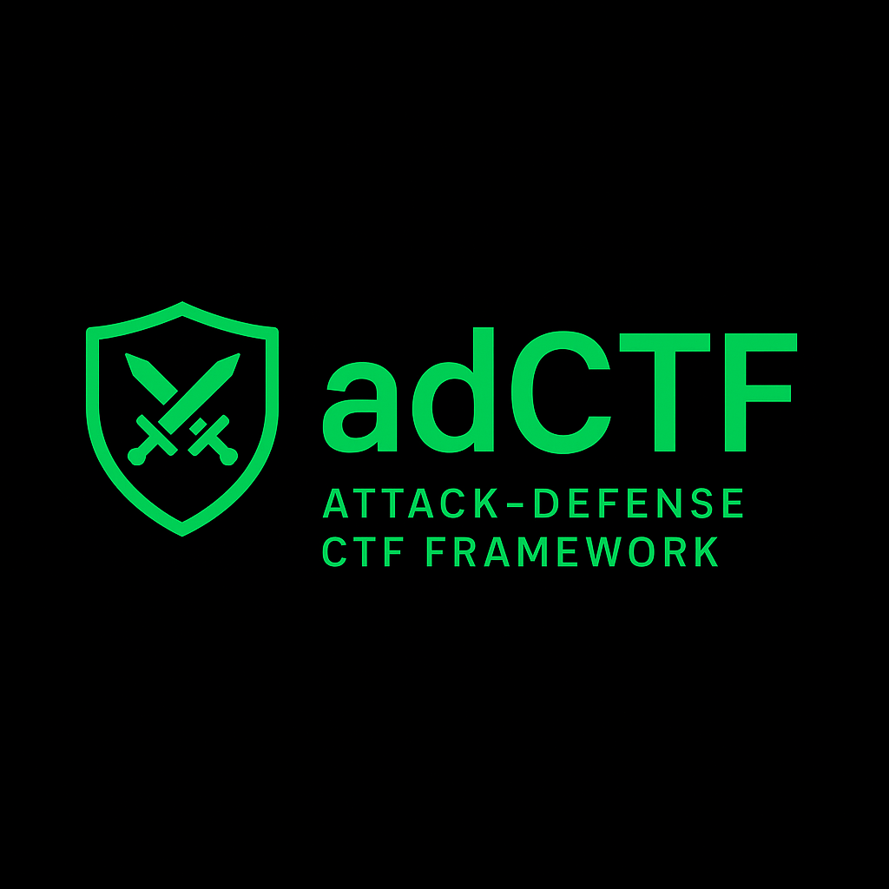

# adCTF - Attack Defense CTF Platform

<div align="center">



**The open-source platform for simple and easy Attack Defense CTFs**

[](LICENSE)
[](https://python.org)
[](https://docker.com)

</div>

## 🎯 Overview

adCTF is a comprehensive, open-source Attack Defense CTF platform designed to make hosting Attack Defense competitions simple and accessible. Whether you're organizing a small educational event or a large-scale competition, adCTF provides all the tools you need to manage teams, challenges, and scoring in real-time.

### ✨ Key Features

- **🔧 Easy Setup**: One-command deployment using Docker Compose
- **👥 Team Management**: Complete team registration and authentication system
- **🏆 Challenge Management**: Deploy and manage challenge services effortlessly
- **⏱️ Round Configuration**: Flexible tick-based scoring system
- **📊 Real-time Scoreboard**: Live updates via WebSocket connections
- **🛡️ SLA Monitoring**: Automated service availability checking
- **🔌 Participant Node**: Isolated challenge environment for teams
- **📈 Admin Dashboard**: Comprehensive competition management interface

## 🚀 Quick Start

### Prerequisites

- Docker & Docker Compose
- Python 3.8+
- Git

### Platform Setup (Organizer)

1. **Clone the repository**
   ```bash
   git clone https://github.com/rayhanhanaputra/adCTF.git
   cd adCTF
   ```

2. **Configure environment**
   ```bash
   cp .env.example .env
   # Edit .env with your configuration
   ```

3. **Start the platform**
   ```bash
   docker-compose up -d
   ```

4. **Access the platform**
   - Main Platform: http://localhost:5000
   - Admin Dashboard: http://localhost:5000/admin

### Participant Node Setup (Teams)

1. **Prepare your server**
   ```bash
   # Download participant node
   git clone https://github.com/rayhanhanaputra/adCTF.git
   cd adCTF/participant-node
   ```

2. **Start participant node**
   ```bash
   sudo python starter.py -u "admin_username" -p "admin_password"
   ```

## 🏗️ Architecture

### Core Components

```
adCTF Platform
├── Web Application (Flask)
│   ├── Admin Dashboard
│   ├── Scoreboard
│   ├── Team Management
│   └── API Endpoints
├── Database (MySQL)
├── Cache (Redis)
├── Challenge Services
└── Participant Nodes
```

### Participant Node Architecture

```
Participant Node
├── Challenge Services (Docker)
├── SLA Checker
├── Flag Receiver
└── Service Monitor
```

## 📋 Configuration

### Environment Variables

Create a `.env` file in the root directory:

```bash
# Flask Configuration
FLASK_ENV=production
SECRET_KEY=your-secret-key-here

# Database Configuration
MYSQL_ROOT_PASSWORD=root_password
MYSQL_DATABASE=adctf
MYSQL_USER=adctf_user
MYSQL_PASSWORD=secure_password
MYSQL_PORT=3306

# Redis Configuration
REDIS_DB=0

# Admin Configuration
ADMIN_USERNAME=admin
ADMIN_PASSWORD=secure_admin_password

# Other Settings
SQLALCHEMY_TRACK_MODIFICATIONS=False
```

### Round Configuration

Configure your competition parameters:

- **Tick Duration**: Time between each scoring round (e.g., 60 seconds)
- **Total Ticks**: Number of ticks in the competition
- **Total Rounds**: Number of rounds in the competition

## 🎮 Competition Management

### Admin Dashboard Features

1. **Team Management**
   - Register/deregister teams
   - View team statistics
   - Reset team credentials

2. **Challenge Management**
   - Deploy challenge services
   - Monitor service status
   - Update challenge configurations

3. **Round Configuration**
   - Set tick duration
   - Configure scoring parameters
   - Start/stop competition

4. **Monitoring**
   - Real-time service status
   - Team connectivity
   - System performance metrics

## 🔧 Challenge Development

### Creating a New Challenge

Adding a new challenge to adCTF involves several steps. **Critical**: The challenge name must match exactly between all components.

#### Step 1: Challenge Service (Docker)

Create your challenge service in `participant-node/services/`:

```
participant-node/services/YourChallenge/
├── docker-compose.yml (contains service definition)
├── Dockerfile
├── src/
│   ├── main.py
│   └── requirements.txt
└── writeup/
    └── README.md
```

#### Step 2: Update Docker Compose Configuration

Add your service to `participant-node/services/docker-compose.yml`:

```yaml
services:
  notes:  # Existing service
    container_name: notes_container
    # ... existing config ...
  
  yourchallenge:  # ⚠️ IMPORTANT: This name must match everywhere
    container_name: yourchallenge_container
    hostname: yourchallenge
    restart: always
    ports:
      - "13000:8000"    # Service port
      - "13022:22"      # SSH port
    build:
      context: YourChallenge
      args:
        - PASSWORD=$PASSWORD_13000
    volumes:
      - ../receiver/flags/yourchallenge.txt:/flag.txt:ro
      - ../utils/bashrc:/root/.bashrc:ro
      - ../utils/preexec.sh:/root/.preexec.sh:ro
    extra_hosts:
      - "host.docker.internal:host-gateway"
```

#### Step 3: Create Challenge Class

Create `participant-node/receiver/challenges/YourChallenge.py`:

```python
from .Challenge import Challenge
import requests
import secrets
import subprocess

class YourChallenge(Challenge):
    flag_location = 'flags/yourchallenge.txt'
    history_location = 'history/yourchallenge.txt'

    def distribute(self, flag):
        """Writes the current flag to the specified location for the service to use."""
        try:
            with open(self.flag_location, 'w') as f:
                f.write(flag)
            
            with open(self.history_location, 'a') as f:
                f.write(flag + '\n')

            self.logger.info(f"Flag '{flag}' distributed successfully to {self.flag_location}")
            return True

        except Exception as e:
            self.logger.error(f"Could not write flag to {self.flag_location}: {e}")
            return False

    def check(self):
        """SLA checker - verify service is working correctly"""
        base_url = f"http://localhost:{self.port}"
        session = requests.Session()

        try:
            # Basic connectivity check
            r = session.get(base_url, timeout=5)
            assert r.status_code == 200, f"Service down: {r.status_code}"
            
            # Add your specific functionality checks here
            # Example: test core features, authentication, etc.
            
            # Verify flag is accessible in container
            with open(self.flag_location, 'r') as f:
                host_flag = f.read().strip()

            container_flag = subprocess.run(
                ["docker", "exec", "yourchallenge_container", "cat", "/flag.txt"],
                capture_output=True,
                text=True
            ).stdout.strip()
            
            assert host_flag == container_flag, 'Flag mismatch between host and container'
            
            self.logger.info('SLA check passed for yourchallenge')
            return True

        except Exception as e:
            self.logger.error(f'SLA check failed for yourchallenge: {e}')
            return False
```

#### Step 4: Register Challenge in Receiver

Update `participant-node/receiver/main.py`:

```python
# Import your challenge class
from challenges.YourChallenge import YourChallenge

# Add your challenge to the challenges dictionary
challenges = {
    "notes": Notes(12000),
    "yourchallenge": YourChallenge(13000),  # ⚠️ Name must match docker service name
}
```

#### Step 5: Add Environment Variables

Update `participant-node/receiver/.env`:

```properties
# Add password for your challenge port
PASSWORD_13000=your_generated_password_here
```

#### Step 6: Add Challenge to Main Platform

In the main platform, add your challenge to the database via admin panel:

```sql
INSERT INTO challenge (name, title, port, description) VALUES 
('yourchallenge', 'Your Challenge Title', 13000, 'Description of your challenge');
```

Or use the admin web interface at `/admin/challenges`.

### 🚨 Critical Naming Requirements

**The challenge name MUST be identical in all these locations:**

1. **Docker service name** in `participant-node/services/docker-compose.yml`
2. **Challenge key** in `participant-node/receiver/main.py` challenges dictionary
3. **Challenge name** in the main platform database
4. **Container name prefix** (e.g., `yourchallenge_container`)
5. **Flag file name** (e.g., `yourchallenge.txt`)

### Example: Complete "webshop" Challenge

#### docker-compose.yml
```yaml
webshop:
  container_name: webshop_container
  hostname: webshop
  ports:
    - "14000:8000"
    - "14022:22"
  # ... rest of config
```

#### main.py
```python
challenges = {
    "notes": Notes(12000),
    "webshop": WebShop(14000),  # Name matches docker service
}
```

#### Database
```sql
INSERT INTO challenge (name, title, port, description) VALUES 
('webshop', 'Online Web Shop', 14000, 'Exploit this e-commerce application');
```

### Port Allocation Guidelines

- **Service ports**: Use increments of 1000 (12000, 13000, 14000, etc.)
- **SSH ports**: Service port + 22 (12022, 13022, 14022, etc.)
- **Environment variables**: `PASSWORD_{SERVICE_PORT}` (PASSWORD_12000, PASSWORD_13000, etc.)

### Testing Your Challenge

1. **Build and start services**:
   ```bash
   cd participant-node/services
   docker-compose up -d yourchallenge
   ```

2. **Test the receiver endpoints**:
   ```bash
   cd participant-node/receiver
   python -m uvicorn main:app --reload --port 8001
   
   # Test restart
   curl -u "admin:password" http://localhost:8001/restart/yourchallenge
   
   # Test SLA check
   curl -u "admin:password" http://localhost:8001/check/yourchallenge
   ```

3. **Verify in main platform**:
   - Access `/challenges` in the web interface
   - Verify restart/rollback buttons work
   - Check that SLA monitoring functions correctly

## 🛡️ Security Considerations

- **Network Isolation**: Participant nodes should be properly isolated
- **Resource Limits**: Docker containers should have resource constraints
- **Access Control**: Implement proper authentication and authorization
- **Monitoring**: Log all administrative actions
- **Backup**: Regular database backups recommended

## 📊 Scoring System

### Attack Defense Scoring

1. **Attack Points**: Earned by successfully exploiting other teams
2. **Defense Points**: Earned by maintaining service availability
3. **SLA Penalties**: Deducted for service downtime

### Calculation Formula

```
total_score = (total_attack_score + total_defense_score) * availability_score
availability_score = max(0.1, passed_checks / total_checks)
```

## 🤝 Contributing

We welcome contributions from the community! Please see our [Contributing Guidelines](CONTRIBUTING.md) for details.

### Development Setup

1. **Clone and setup**
   ```bash
   git clone https://github.com/rayhanhanaputra/adCTF.git
   cd adCTF
   python -m venv venv
   source venv/bin/activate  # Linux/Mac
   # or
   venv\Scripts\activate     # Windows
   pip install -r requirements.txt
   ```

2. **Setup the initial database**
   ```bash
   python init_db.py
   ```

3. **Run in development mode**
   ```bash
   python run.py
   ```

### Code Style

- Follow PEP 8 for Python code
- Use meaningful variable and function names
- Add docstrings for public functions
- Write tests for new features

## 🐛 Troubleshooting

### Common Issues

1. **Database Connection Issues**
   - Verify MySQL is running
   - Check database credentials
   - Ensure database exists

2. **Docker Compose Errors**
   - Update Docker and Docker Compose
   - Check port availability
   - Verify environment variables

3. **Participant Node Issues**
   - Check network connectivity
   - Verify credentials
   - Review Docker service logs

4. **Challenge Integration Issues**
   - **401 Unauthorized on restart/rollback**: Check `ADMIN_USERNAME` and `ADMIN_PASSWORD` match between main platform `.env` and participant-node `.env`
   - **Challenge not found**: Ensure challenge name matches exactly in docker-compose.yml, main.py, and database
   - **SLA check fails**: Verify challenge class implements `check()` method correctly
   - **Flag distribution fails**: Check file permissions and paths in challenge class
   - **Port conflicts**: Ensure each challenge uses unique ports and they're not already in use

### Challenge Development Debugging

1. **Check challenge registration**:
   ```bash
   # In participant-node/receiver
   python -c "from main import challenges; print(list(challenges.keys()))"
   ```

2. **Test challenge class directly**:
   ```bash
   python -c "from challenges.YourChallenge import YourChallenge; c = YourChallenge(13000); print(c.check())"
   ```

3. **Verify Docker service**:
   ```bash
   docker-compose ps yourchallenge
   docker-compose logs yourchallenge
   ```

4. **Test API endpoints**:
   ```bash
   curl -u "admin:password" http://localhost:8001/check/yourchallenge
   ```

## 📄 License

This project is licensed under the MIT License - see the [LICENSE](LICENSE) file for details.

## 🙏 Acknowledgments

- Thanks to all contributors and the CTF community
- Inspired by various CTF platforms and the need for simpler Attack Defense competitions

## 📞 Support

- **GitHub Issues**: [Report bugs or request features](https://github.com/rayhanhanaputra/adCTF/issues)
- **Discussions**: [Community discussions](https://github.com/rayhanhanaputra/adCTF/discussions)
- **Email**: admin@siberlab.id

---

<div align="center">

**Made with ❤️ by SiberLab ID for the CTF community**

[Website](https://siberlab.id)

</div>